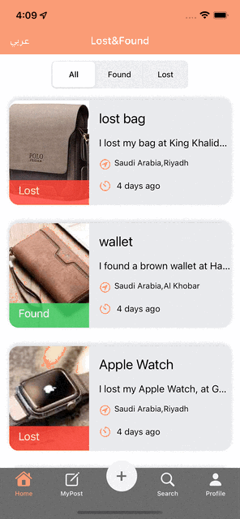
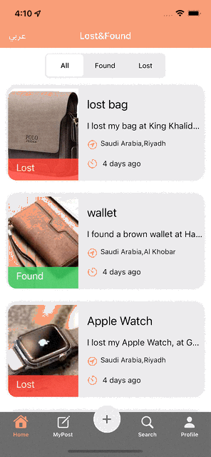

# Found_And_Lost_Items

## Description

- Lost & Found Items is an Application with idea to create a platform that allow the users to share the lost and found items description, location, and a way to communicate with the original owner to reduce the stress of finding lost items by collaboration search.

## Demo
- Login

- Home & Edit & Comments

-  MyPost & Posting & Search & Profile

## user Stories 

- as a user I can Register in app
- as a user I can login to app
- as a user I can add posts
- as a user I can Show mine and others posts
- as a user I can edit my posts 
- as a user I can edit my information  
- as a user I can search in posts
- as a user I can add comment on posts

## Framework
- UIKit
- Firebase
- CoreLocation
- Mapkit
- Lottie

## ERD

## Wireframe

