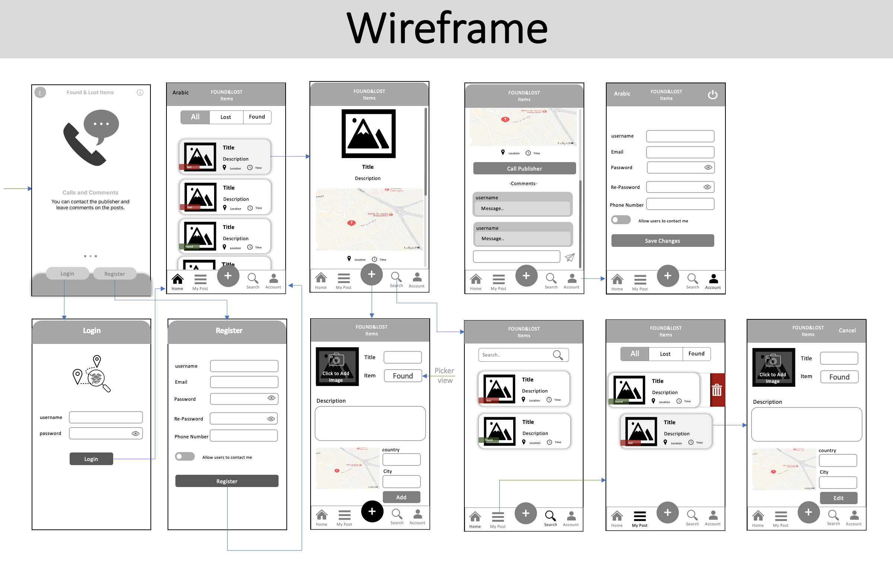

# Found_And_Lost_Items

## Description

- Lost & Found Items is an Applicatin with idea to craete a plateform that allaw the users to share the lost and found items descreption, location, and a way to communcate with the orginal owner to reduse the stress of finding lost items by collobration search.

## Demo
- Login

- Calls & Comments

## user Stories 

- as a user I can Register in app
- as a user I can login to app
- as a user I can add posts
- as a user I can Show mine and others posts
- as a user I can edit my posts 
- as a user I can edit my information  
- as a user I can search in posts
- as a user I can add comment on posts

## Framework
- UIKit
- Firebase
- CoreLocation
- Mapkit
- Lottie

## ERD

## Wireframe

